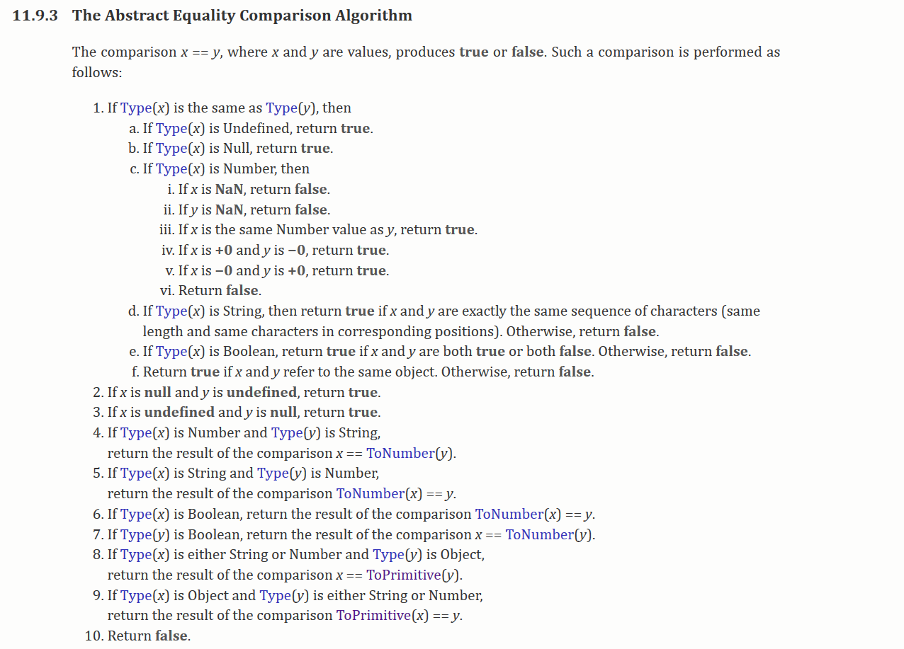

### 转Boolean

在条件判断时，除了 `undefined`， `null`， `false`， `NaN`， `''`， `0`， `-0`，其他所有值都转为 `true`，包括所有对象

### `==` 操作符


这里来解析一道题目 `[] == ![] // -> true` ，下面是这个表达式为何为 `true` 的步骤

```js
typeof([]) // "object"
typeof(![]) // "boolean"

// [] 转成 true，然后取反变成 false
[] == false

// 根据第7 If Type(y) is Boolean, return the result of the comparison x == ToNumber(y).
[] == 0

// 根据第9 If Type(x) is Object and Type(y) is either String or Number. return the result of the comparison(x) == y
// [].toString() -> ''
'' == 0

// 根据第7 
0 == 0 // => true

```

